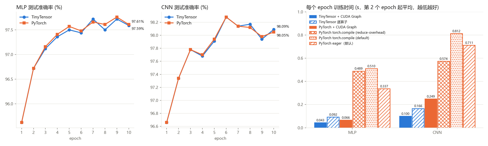
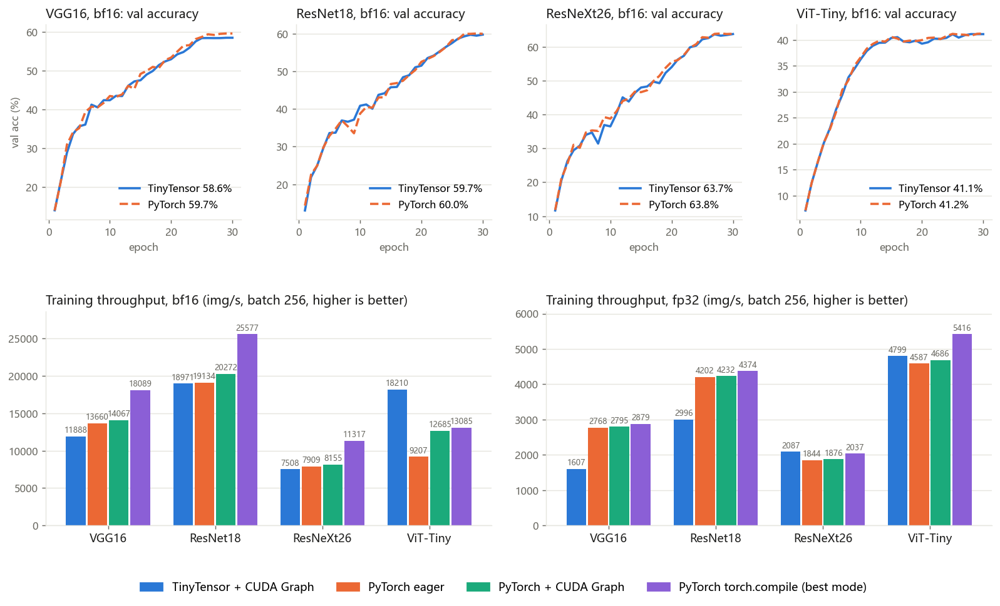

# pku-aiprogramming
Homework for course Programming in Artificial Intelligence, Peking University in 2023.


## Please do not directly copy my work for your study!


## Build

Please download pybind11 to the  folder tinytensor and run setup.py to build. Referring to the PDF task3 for more information.

Task3 is built and benchmarked on Linux / WSL. Run the build inside `Task3/Tinytensor`. The script only needs nvcc,
numpy and pybind11 headers, and it writes the modules to `optimizer/`. `PYTHON` selects the interpreter the modules are
built for:

```bash
PYTHON=~/tt-venv/bin/python NVCC=/usr/local/cuda-12.8/bin/nvcc ./build_linux.sh
```

`setup.py` (PyTorch `CUDAExtension`) is kept as an alternative build.

### WSL environment used for all numbers below

| Item | Version / setting |
|---|---|
| Host | Windows 11, RTX 4060 Laptop (8 GB), NVIDIA driver 616.92 installed on Windows; WSL reaches it through `/usr/lib/wsl/lib` |
| WSL | `Ubuntu-20.04` (20.04.6), WSL2 kernel 5.15.167.4-microsoft, 32 CPU threads, ~7 GB RAM given to WSL |
| Compiler | gcc 11.5, CUDA toolkit 12.8 (`/usr/local/cuda-12.8/bin/nvcc`); no driver is installed inside WSL |
| Python | venv `~/tt-venv`: Python 3.12.7, numpy, pybind11, matplotlib, torch 2.14.1+cu126, triton 3.8.0 |
| Data | MNIST raw files (`train-images-idx3-ubyte` ...), passed with `--data <dir>` |

To set it up from scratch, run these inside WSL:

```bash
python3.12 -m venv ~/tt-venv
~/tt-venv/bin/pip install numpy pybind11 matplotlib torch --index-url https://download.pytorch.org/whl/cu126
# CUDA toolkit only (the driver comes from Windows): install NVIDIA's "WSL-Ubuntu" cuda-toolkit-12-8 package
cd Task3/Tinytensor && PYTHON=~/tt-venv/bin/python NVCC=/usr/local/cuda-12.8/bin/nvcc ./build_linux.sh
cd optimizer && ~/tt-venv/bin/python test_ops.py
```

From Windows, call WSL through PowerShell: `wsl -d Ubuntu-20.04 -- bash script.sh`. Git-Bash rewrites `$var` and
`/mnt/...` paths before they reach WSL, so put multi-line commands in a script file.
TinyTensor and PyTorch are always compared in the same venv and the same WSL session.

## Run Task3

Run inside `Task3/Tinytensor/optimizer`:

```bash
python test_ops.py                      # operator checks, CNN finite differences, fused == unfused, CUDA Graph == eager
python mnist_mlp.py --epochs 10         # TinyTensor MLP (CUDA Graph by default, --no-graph for op-by-op)
python mnist_cnn.py --epochs 10         # TinyTensor CNN
python torch_baseline.py --arch cnn     # same model / init / data order in PyTorch (eager)
python torch_baseline.py --arch cnn --graph                     # PyTorch + manual CUDA Graph
python torch_baseline.py --arch cnn --compile reduce-overhead   # PyTorch + torch.compile (also: default)
python profile_step.py --framework tiny --arch cnn --graph      # per-kernel GPU time + GPU timeline via torch.profiler (CUPTI)
```

Common options: `--optimizer sgd|adam --lr --batch --seed --chunk --data <MNIST raw dir> --save <json>`.
`../bench_wsl.sh` runs all twelve configurations in one environment. `Task3/results/plot_results.py` then draws
`compare.png` from the saved json files:

```bash
PYTHON=~/tt-venv/bin/python DATA=<MNIST raw dir> EPOCHS=10 SAVE=<repo>/Task3/results/json ./bench_wsl.sh
```

TinyTensor initializes the weights itself: Kaiming uniform from the CUDA `random` kernel (`tiny_nn.kaiming_uniform`).
The TinyTensor scripts export the initial weights to `Task3/results/init/<arch>_seed<seed>.npz`, and
`torch_baseline.py` loads the same file. Run the TinyTensor script first.

How the training step runs on the GPU:

- Tensors stay on the GPU between ops; only the loss is read back, and only when asked for. The training set is
  uploaded once and the shuffled order once per epoch. Each step picks its batch on the GPU from a step counter that
  also lives on the GPU. `gather_xy` is one kernel that gathers x and y and advances the counter.
- Fused kernels:
  - conv + ReLU + 2x2 max-pool. The forward stores a 2-bit argmax. The backward is a gather with no atomics, and it
    also zeroes the weight gradient.
  - FC + bias + ReLU.
  - softmax + cross-entropy in one kernel.
  - one multi-tensor SGD update.
- Small-channel convolutions use direct CUDA kernels. The 3x3 case is specialized at compile time, and each thread
  computes several output channels. The weight gradient accumulates all taps in registers and reduces with warp
  shuffles. Larger convolutions fall back to im2col + strided-batched GEMM.
- Gradients that nothing needs (e.g. w.r.t. the input images) are skipped.
- Consecutive training steps (`--chunk`, default 100) are captured into one CUDA Graph and replayed.

Kernels per training step:

| Model | TinyTensor | PyTorch + CUDA Graph |
|---|---|---|
| CNN | 20 | 45 |
| MLP | 12 | 25 |

## Results

Setup: RTX 4060 Laptop, WSL Ubuntu 20.04, Python 3.12, PyTorch 2.14.1+cu126 in the same venv. 10 epochs, SGD lr=0.1,
batch 100, seed 0. s/epoch is the mean of epochs 2-10, because epoch 1 includes CUDA Graph capture or torch.compile
compilation. `bench_wsl.sh` ran all twelve configurations back to back:

| Model | Mode | s/epoch | Test acc |
|---|---|---|---|
| MLP | **TinyTensor + CUDA Graph** | **0.043** | 97.59% |
| MLP | TinyTensor op-by-op | 0.092 | 97.59% |
| MLP | PyTorch + CUDA Graph | 0.066 | 97.61% |
| MLP | PyTorch eager | 0.337 | 97.61% |
| MLP | PyTorch torch.compile (default) | 0.510 | 97.61% |
| MLP | PyTorch torch.compile (reduce-overhead) | 0.489 | 97.61% |
| CNN | **TinyTensor + CUDA Graph** | **0.100** | 98.09% |
| CNN | TinyTensor op-by-op | 0.166 | 98.03% |
| CNN | PyTorch + CUDA Graph | 0.249 | 98.05% |
| CNN | PyTorch eager | 0.711 | 98.00% |
| CNN | PyTorch torch.compile (default) | 0.812 | 97.94% |
| CNN | PyTorch torch.compile (reduce-overhead) | 0.574 | 98.08% |



Both frameworks start from the same init and the same data order, so their accuracy curves overlap. The small
differences between runs come from the order of float `atomicAdd`s in the weight-gradient reductions (TinyTensor) and
from cuDNN's algorithm choice (PyTorch).

### torch.compile

On this workload torch.compile is slower than plain eager PyTorch. A step here is only 0.1-0.4 ms of GPU work, so
the CPU cost of launching it decides the speed.

- `default`: Inductor fuses the elementwise ops, but the compiled forward/backward still runs through the autograd
  engine and many Triton launches.
- `reduce-overhead`: the CUDA-Graph trees add per-call bookkeeping (`cudagraph_mark_step_begin`, input copies), and that
  costs more than the whole step.
- Compilation itself takes 7-10 s, which is why epoch 1 is much slower.
- Compiling the full step with compiled autograd was slower still (about 0.9 s/epoch for the MLP).

The fastest PyTorch variant measured was not a standard torch.compile mode. It took Inductor-compiled kernels
(`max-autotune-no-cudagraphs`) and captured them, together with the optimizer, into a manual CUDA Graph: MLP 0.046
s/epoch, CNN 0.20 s/epoch. That is still slower than TinyTensor + CUDA Graph, and because it is not part of the
standard API it is left out of the table.

### GPU utilization: stable and efficient?

These numbers come from `profile_step.py` (CUPTI timeline, no extra synchronization inside the step) and from
`nvidia-smi` sampling every 200 ms.

- **Inside a step, the GPU never waits.** With CUDA Graph, in both frameworks, a kernel is running for more than 93%
  of the step's GPU time span. Gaps between kernels are under 2 µs, and there are no 10-50 µs bubbles.
- **Between graphs, WSL submission is the limit.** Under WSL2, each graph node costs about 4 µs of CPU time at launch.
  Capturing more steps into one graph therefore saves no CPU time, and every kernel removed from a step saves wall
  time directly. That is why the CNN step went from 50 to 28 to 20 kernels. The changes were:
  - the fused kernels;
  - merging the batch gather and the counter into one kernel;
  - folding the weight-gradient memset into the pool backward;
  - setting the cuBLAS workspace to 0, which disables split-K and its extra `splitKreduce` kernels. This alone took
    the CNN from 0.219 to 0.179 ms/step, even though the GEMMs themselves got slightly slower. `TT_CUBLAS_WS=<bytes>`
    re-enables split-K.
- **Per-step time, CNN:**

  | Framework | Wall time | GPU busy |
  |---|---|---|
  | TinyTensor + CUDA Graph | 0.20 ms/step | 0.16 ms/step |
  | PyTorch + CUDA Graph | 0.42 ms/step | almost all of it, mostly cuDNN `wgrad`/`dgrad` |

- **Clocks are not stable on this laptop.**
  - During the benchmark, the SM clock moved between 1.8 and 2.5 GHz (the maximum is 3.1 GHz).
  - The throttle reason was mostly `SW Power Cap` (0x4). The `SW Thermal Slowdown` counter has also accumulated a lot
    of time.
  - Under the Windows "Balanced" power plan, the driver holds the card at about 40 W. The same code measured up to
    1.7x slower during a power-capped period.
  - So compare frameworks only within one back-to-back run, as `bench_wsl.sh` does.
  - For lower and steadier absolute times: switch Windows or the laptop vendor's tool to performance mode, stay on AC
    power, and keep the laptop cool. The code does not change any system settings.

## Bonus: Tiny ImageNet on an A100 (VGG16 / ResNet18 / ResNeXt26 / ViT-Tiny)

The bonus extends the same TinyTensor framework and trains four networks on Tiny ImageNet. The new kernels live in
`Task3/Tinytensor/src/nn`: NHWC convolution, BatchNorm, LayerNorm, attention, and bf16 versions of these ops. Tiny
ImageNet has 200 classes, 100k training images and 10k validation images, all 64x64. Every result below was measured
on the same GPU against PyTorch.

### Setup

- **GPU:** A100-SXM4-80GB on Colab, PyTorch 2.11.0+cu130.
- **Networks:** defined in `optimizer/models.py` and mirrored layer by layer in `torch_imagenet.py`.

  | Network | Params | Notes |
  |---|---|---|
  | VGG16-BN | 14.8 M | 13 conv + BN + ReLU, 5 max-pools, global average pool, one FC |
  | ResNet18 | 11.3 M | 3x3 stride-1 stem + 2x2 max-pool, 4 stages of basic blocks |
  | ResNeXt26 (32x4d) | 13.7 M | bottleneck blocks [2, 2, 2, 2], 32-group 3x3 convolutions |
  | ViT-Tiny | 5.4 M | 8x8 patches (64 tokens + cls), D=192, 3 heads, 12 pre-norm blocks |

- **Training:**
  - 30 epochs, batch 128.
  - Random crop (pad 4) and horizontal flip, both done on the GPU.
  - Optimizer: SGD with momentum for the CNNs (lr 0.05 for VGG, 0.1 for the ResNets, wd 5e-4); AdamW for ViT
    (lr 1e-3, wd 0.05).
  - Learning rate: linear warmup, then cosine decay.
- **Same starting point:**
  - TinyTensor initializes the weights and exports them; PyTorch loads that file.
  - Both use the same shuffled order and the same augmentation seeds.
  - `test_imagenet_match.py` checks that the first steps of the two frameworks agree. The test fails if the relative loss
    difference in steps 0-2 reaches 1e-4 in fp32 or 1e-2 in bf16. Measured on the A100: at most 8.5e-6 in fp32 and about 1e-3 in
    bf16.
- **Precision:**
  - fp32 is real fp32 on both sides. TF32 is off in PyTorch, and TinyTensor never uses it.
  - bf16 is mixed precision. PyTorch uses `torch.autocast` with channels_last.
  - TinyTensor keeps fp32 master weights and fp32 BN/LN statistics. Convolutions and matmuls run on bf16 tensor cores
    (`mma.sync`).
- **Timing:**
  - The GPU is synchronized only at the start and end of each timed region.
  - Loss and accuracy are accumulated on the GPU and read back once per epoch.

To run, first prepare the data. `prepare_tiny_imagenet.py <tiny-imagenet-200 dir>` writes `.npy` files to
`~/data/tiny-imagenet-200`. Then, inside `Task3/Tinytensor/optimizer`:

```bash
python imagenet_train.py --arch resnet18 --dtype bf16 --epochs 30          # TinyTensor (CUDA Graph)
python torch_imagenet.py --arch resnet18 --dtype bf16 --epochs 30          # PyTorch eager, same init / data
python imagenet_train.py --arch resnet18 --dtype bf16 --batch 256 --bench 50 --train-limit 51200   # throughput
python torch_imagenet.py --arch resnet18 --dtype bf16 --batch 256 --bench 50 --train-limit 51200 --graph
python torch_imagenet.py --arch resnet18 --dtype bf16 --batch 256 --bench 50 --train-limit 51200 --compile default
python imagenet_train.py --arch resnet18 --dtype bf16 --batch 256 --bench 50 --train-limit 51200 --no-fuse
python test_nn_ops.py                                                      # every op vs PyTorch (fp64 reference)
python test_imagenet_match.py --arch vit_tiny --dtype bf16                 # first steps match PyTorch
python profile_imagenet.py --framework tiny --arch resnext26 --dtype bf16  # per-kernel GPU time
```

For PyTorch's other compile mode, replace `--compile default` with `--compile max-autotune-no-cudagraphs`. The
`--no-fuse` line is the ablation described below: BN, add, ReLU and GELU each run as a separate kernel.

### Accuracy (30 epochs, top-1 on the val set)

TinyTensor runs with CUDA Graph. PyTorch runs in eager mode. Both start from the same initial weights and see the same data order. Wall time covers the full 30 epochs, including evaluation.

| Network | dtype | TinyTensor val acc | PyTorch val acc | TinyTensor time | PyTorch time |
|---|---|---|---|---|---|
| VGG16 | bf16 | 58.56% | 59.66% | 285 s | 253 s |
| ResNet18 | bf16 | 59.74% | 59.96% | **188 s** | 280 s |
| ResNeXt26 | bf16 | 63.75% | 63.83% | 442 s | 425 s |
| ViT-Tiny | bf16 | 41.13% | 41.25% | **180 s** | 635 s |
| ResNet18 | fp32 | 59.30% | 59.84% | 1112 s | 759 s |



Final accuracies agree to within about 1 point, which is the run-to-run noise. Two TinyTensor VGG16 bf16 runs whose
only difference is the summation order inside BN and max-pool (before and after the vectorized kernels) ended at 59.55%
and 58.56%. The first 3 steps of each run still match PyTorch to the tolerances above. The two frameworks drift apart
only later, because bf16 rounding differences accumulate over 23k steps.

### Training throughput (batch 256, ms per step, lower is better)

| Network | dtype | TinyTensor + CUDA Graph | TinyTensor eager | PyTorch eager | PyTorch + CUDA Graph | PyTorch torch.compile (best mode) |
|---|---|---|---|---|---|---|
| VGG16 | bf16 | 21.5 | 21.6 | 18.7 | 18.2 | **14.2** |
| ResNet18 | bf16 | 13.5 | 13.6 | 13.4 | 12.6 | **10.0** |
| ResNeXt26 | bf16 | 34.1 | 34.4 | 32.4 | 31.4 | **22.6** |
| ViT-Tiny | bf16 | **14.1** | 14.6 | 27.8 | 20.2 | 19.6 |
| VGG16 | fp32 | 159.3 | 159.4 | 92.5 | 91.6 | **88.9** |
| ResNet18 | fp32 | 85.4 | 85.6 | 60.9 | 60.5 | **58.5** |
| ResNeXt26 | fp32 | **122.6** | 122.8 | 138.9 | 136.5 | 125.7 |
| ViT-Tiny | fp32 | 53.3 | 53.9 | 55.8 | 54.6 | **47.3** |

The three PyTorch modes:

- **eager:** each op launches one cuDNN / cuBLAS / ATen kernel from Python.
- **CUDA Graph:** the same kernels, captured once and replayed. This removes the CPU launch cost.
- **torch.compile:**
  - Dynamo captures the graph.
  - Inductor fuses elementwise ops and reductions into Triton kernels.
  - Convolutions and GEMMs still go to cuDNN / cuBLAS.
  - `max-autotune-no-cudagraphs` also autotunes Triton GEMM templates.
  - The table shows whichever of `default` and `max-autotune-no-cudagraphs` was faster.

TinyTensor has no compiler. Its fusions are written by hand, and it captures its CUDA Graph explicitly. Its fair
counterpart is therefore torch.compile, and the main comparison is against the fastest PyTorch mode.

Where TinyTensor stands:

- **ViT-Tiny, bf16: TinyTensor is the fastest, 1.4x faster than torch.compile.**
  - One kernel computes the whole attention for one (batch, head) in shared memory: Q·Kᵀ, softmax, then ·V.
  - LayerNorm takes a single pass.
  - Bias + GELU are fused into the GEMM epilogue.
- **CNNs, bf16: about the same as PyTorch eager, but 1.35-1.5x slower than torch.compile.**
  - The remaining gap is the convolutions: cuDNN's implicit-GEMM kernels are still faster than TinyTensor's
    `ConvTc`.
  - Example, a VGG layer with 64 channels: forward 0.22 ms (cuDNN) vs 0.36 ms (TinyTensor); weight gradient 0.36 ms
    vs 0.61 ms.
- **CNNs, fp32: slower, except ResNeXt26.**
  - In fp32, cuDNN switches to Winograd (`scudnn_winograd_128x128`) and FFT (`fft2d_r2c`, `gcgemm`) convolutions.
    These do far fewer FLOPs than an implicit GEMM.
  - TinyTensor's fp32 convolution is a plain implicit GEMM on CUDA cores.
  - ResNeXt26 is dominated by grouped convolutions, where cuDNN has no such shortcut, and TinyTensor's direct
    grouped kernels win.

### Fusion ablation (`--no-fuse`)

With `--no-fuse`, BatchNorm only normalizes, and the residual add, ReLU and GELU each run as a separate kernel. The
math is unchanged, and all eight `test_imagenet_match.py` checks pass in this mode too.

Fused vs. unfused, measured back to back in one session (commit 67e2107):

| Network | dtype | fused (ms/step) | unfused (ms/step) | slowdown | peak memory, fused → unfused |
|---|---|---|---|---|---|
| VGG16 | bf16 | 22.97 | 25.01 | +9% | 2702 → 3254 MB |
| ResNet18 | bf16 | 14.31 | 15.84 | +11% | 2394 → 2842 MB |
| ResNeXt26 | bf16 | 35.11 | 41.05 | +17% | 4862 → 6606 MB |
| ViT-Tiny | bf16 | 14.36 | 15.42 | +7% | 2734 → 2746 MB |
| ResNeXt26 | fp32 | 123.05 | 129.82 | +5.5% | 8596 → 12064 MB |

- The other fp32 networks slow down by 1.5-2.5%.
- Fusion matters more in bf16. The convolutions are fast there, so the memory-bound elementwise passes take a larger
  share of the step.
- Fusion also saves memory: the BN output before ReLU and the result of the add are never stored.

### How the bf16 step got faster

Each change was chosen from the per-kernel GPU time (`profile_imagenet.py`, CUPTI) and then measured on the A100.
Times are ms/step.

| Change | VGG16 bf16 | ResNet18 bf16 | ResNeXt26 bf16 |
|---|---|---|---|
| Baseline (tensor-core `ConvTc`, scalar BN kernels) | 31.6 | 20.1 | 57.7 |
| BatchNorm: 8 channels per thread, 16-byte loads, no 64-bit modulo per element, larger grids | 22.95 | 14.31 | 35.10 |
| Max-pool fwd/bwd and gradient add: 8 channels per thread, 16-byte loads | 21.53 | 13.49 | 34.10 |

**BatchNorm.** Before this change, BN was the biggest cost in bf16.

- It took about 33 ms of ResNeXt26's 58 ms per step. PyTorch's BN takes about 11 ms.
- The old kernels read 2 bytes per load, and computed `i % C` in 64 bits for every element.
- After the change, BN takes about 11 ms per step in ResNeXt26.

**Convolution (`conv_tc.cu`).** Earlier work on the convolution kernel itself:

- bf16 tensor cores via `mma.sync`, multi-stage `cp.async` pipelines, and double-buffered fragments.
- A tile configuration chosen per layer shape (`TT_TC_CFG=small|auto|big`).
- Forward kernels with 256-row tiles stage their output through shared memory, so each warp writes full 16-byte
  vectors.
  - Why: ncu showed the stores used only 16 of the 32 bytes in each sector.
  - Effect: VGG's 64-channel forward went from 0.39 to 0.36 ms.
  - The same staging made dgrad and small layers slower (register spills), so it is enabled only in this case.

**What is left.** ResNeXt26 bf16 now takes 34 ms per step:

- `ConvTc` (forward, data gradient, weight gradient): about 12 ms.
- BN: about 11 ms.
- Grouped convolutions: about 9 ms.

Notes:

- **Stem dgrad.** The 3→64 stem convolution needs no input gradient, so no dgrad kernel runs for it in training. The
  slow stem dgrad that `bench_conv.py` reports never runs in a real step.
- **Graph warm-up in the benchmark.** The timed region is split into CUDA Graphs of `--chunk` steps. Every graph
  length used in the timed region is captured during warm-up. An earlier version captured the last, shorter graph
  inside the timed region, which made "graph" look slower than eager.

The raw results are in `Task3/results/imagenet_a100/*.json`, and `Task3/results/plot_imagenet.py` draws the chart.
